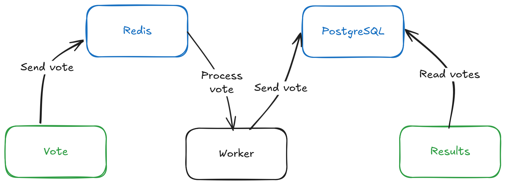
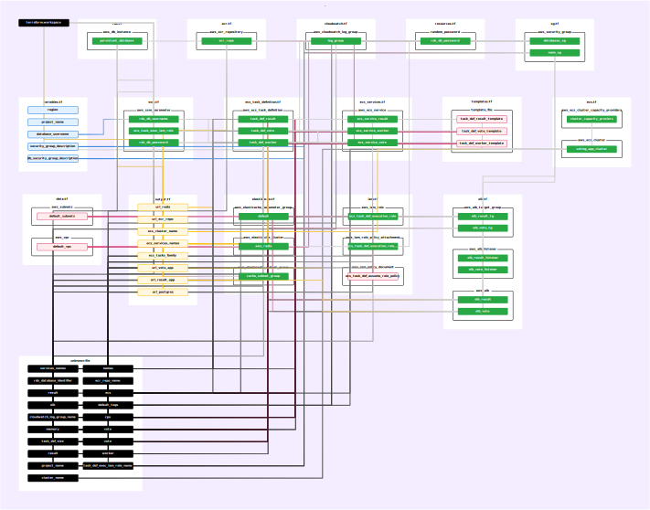

# Example Voting App - AWS ECS stack

A simple distributed application running across multiple Docker containers.

This example is modified to run into AWS ECS using Fargate.

The Linux stack uses Python, .NET and Golang to create the vote, worker, and results applications.

The Docker images present on this repo are modified versions of the original repo [example-voting-app](https://github.com/dockersamples/example-voting-app/)
with the Docker, Docker-Compose and Kubernetes configurations.

The original result application here was replaced by a Golang example, which in my opnion is better than the .NET solution.

This approach utilizes the AWS services for orchestrating the containers and bring the voting and result apps available online, using Terraform as IaC.

This repository also has a GitHub Actions pipeline that will build the container images to be used by the AWS ECS service after the infrastructure deployment.

## Getting started

The preferable order of execution on this project would be:

- Run the container images with Docker and docker compose locally and test the application behavior;
- Execute the tofu commands to build your base infrastructure;
  - Annotate the outputs on the console since you're going to need that to access the application; 
- Run the GitHub Actions pipeline using GitHub or my favorite local alternative (great project !) [nektos act tool](https://nektosact.com/)
- Access the applications (vote and/or results);

### Requisites
This setup was tested on this environment:

- OpenTofu v1.11.4
  - Optionally: tflint 0.61.0
- AWS CLI 2.33.19
- Python 3.13.12
- If you want to run the containers locally:
  - Docker 29.2.0
  - Docker Compose v5.0.2

## How it works

### The apps structure

### Terraform

* Graph renderized with [im2nguyen/rover](https://github.com/im2nguyen/rover) *